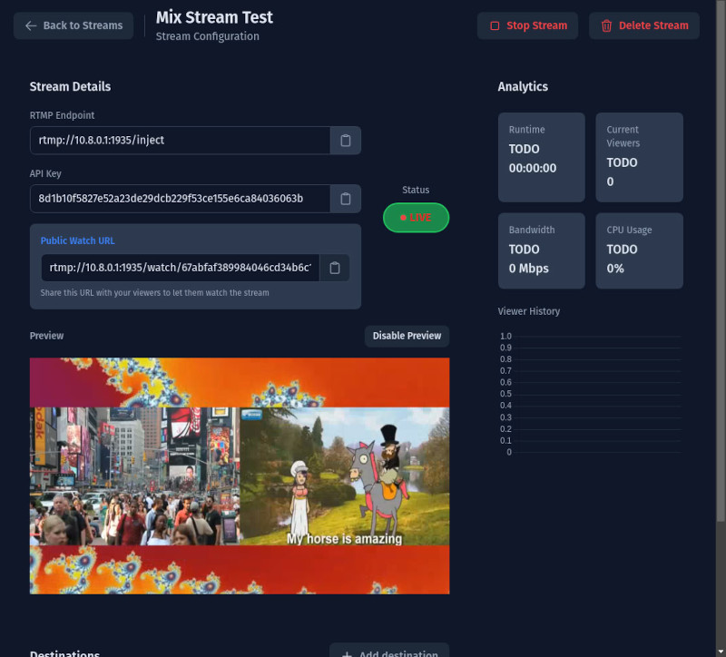

# open-stream-hub
A web app meant to be simple, and run on server.
Uses ffmpeg to redirect input stream from RTMP to other platforms (like Twitch, YouTube, etc).
Can also be used just as RTMP server it self.

## !!!! App is in development, use at your own risk. !!!!


# Deploy for development
### Requirements
- MongoDB
- NodeJS
- ffmpeg

First you need MongoDB running, then,

To run all, in dev mode, run following from the projects root:
```bash
npm run dev
```

Or to run individually:

# Frontend
```bash
cd frontend
npm run dev
```

# Backend
```bash
cd backend
npm run start:dev
```

# Deployment Guide

This document describes how to build and deploy the Open Stream Hub stack.

## Prerequisites

- Docker Engine 20.10.0 or newer
- Docker Compose V2
- At least 1GB of free RAM

### For quick deploy
you can just use this docker-compose file with pre-built images. I'll try to keep them up to date on major updates.
```yaml
version: "3.8"

services:
  frontend:
    image: sythinian/open-stream-hub-frontend:latest
    restart: always
    ports:
      - "3000:80"
    depends_on:
      - backend
    environment:
      - VITE_REST_API_HOST=http://localhost:6636

  backend:
    image: sythinian/open-stream-hub-backend:latest
    restart: always
    ports:
      - "6636:6636"  # Rest API port
      - "1935:1935"  # RTMP RTMP server port
    depends_on:
      - mongodb
    environment:
      - MONGODB_URI=mongodb://mongodb:27017/open-stream-hubV2
      - REST_API_PORT=6636
      - RTMP_SERVER_PORT=1935
      - RTMP_INJECT_HOST=rtmp://localhost
      - RTMP_INJECT_ROOT=/inject
      - RTMP_WATCH_ROOT=/watch
      - HSL_PREVIEW_ENABLED=true

  mongodb:
    image: mongo:latest
    restart: always
    volumes:
      - mongodb_data:/data/db

volumes:
  mongodb_data:
```

## Building the Application

### Using Build Scripts

The project includes convenience scripts for building. Run them from the project root:

```bash
# Build everything (frontend and backend) for current architecture
./scripts/build-all.sh

# Build for ARM64
PLATFORMS="linux/arm64" ./scripts/build-all.sh

# Build for multiple architectures (will push to registry)
REGISTRY=yourname/ PLATFORMS="linux/amd64,linux/arm64" ./scripts/build-all.sh

# Build with specific registry and version
REGISTRY=yourname/ VERSION="latest" ./scripts/build-all.sh

# Build individual components
./scripts/build-frontend.sh
./scripts/build-backend.sh
```

Note: When building for multiple architectures, you need to:
1. Install QEMU for cross-platform builds:
```bash
docker run --privileged --rm tonistiigi/binfmt --install all
```
2. Be logged in to your registry:
```bash
docker login your-registry.com
```

## Deploying the Stack

# Environment
- Dev env files are at /backend/.env.dev and /frontend/.env.development
- All variables and their descriptions are located in those env files
- For production, pass your values into docker-compose

### Starting the Stack
First build images, and then:
```bash
cd docker/production
docker-compose up -d
```

## Accessing the Application

Once deployed, the services are available at:
(considering you are using default env config)

- Frontend UI: `http://localhost:3000`
- Backend API: `http://localhost:6636`
- RTMP Endpoint: `rtmp://localhost:1935`
