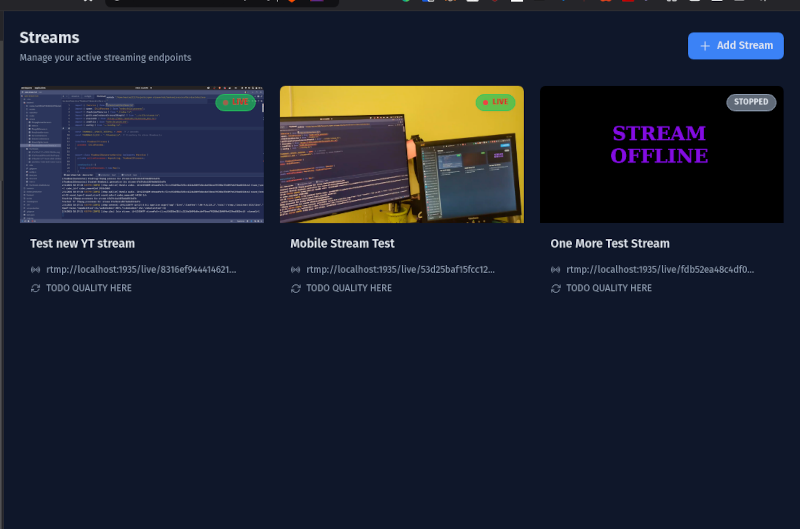

# open-stream-hub
A web app meant to be run on server. Used to redirect single video stream to multiple destinations

## !!!! App is in development, use at your own risk. !!!!

# Deploy for development
### Requirements
- MongoDB
- Deno
- ffmpeg

First you need MongoDB running, then,


To run all, in dev mode, run following from the projects root:
```bash
deno task dev
```

Or to run individually:

# Frontend
```bash
deno run dev:frontend
```

# Backend
```bash
deno run dev:backend
```

# Deployment Guide For production

This document describes how to build and deploy the Open Stream Hub stack in production.

## Prerequisites

- Docker Engine 20.10.0 or newer
- Docker Compose V2
- At least 1GB of free RAM

## Environment Configuration
Enviroment files are located in root.

KNOWN ISSUE: Some frontend variables are baked in while building production docker image.
So if you later change them in docker-compose, it won't work. You'll have to rebuild frontend docker image.

```env
MONGODB_URI=mongodb://localhost:27017/open-stream-hub

# Port RTMP server will use to accept incoming streams
RTMP_INJECT_PORT=1935

# Public URL for the RTMP server.
# If you are hosting service on 10.10.10.5
# you probably want this set to rtmp://10.10.10.5
RTMP_INJECT_PUBLIC_URL=rtmp://localhost

# Root path for the RTMP injection
# Final inject path will be RTMP_INJECT_PUBLIC_URL + RTMP_INJECT_LINK_ROOT
RTMP_INJECT_LINK_ROOT=/live

# Live priview thumbnails can be disabled to save resources
REALTIME_THUMBNAIL_DISABLED=false

REST_API_HOST=http://localhost
REST_API_PORT=6636

FRONTEND_PORT=3000
```

## Building the Application

### Using Build Scripts

The project includes convenience scripts for building, run them from the project root.

```bash
# Build everything (frontend and backend)
./scripts/build-all.sh

# Build only frontend
./scripts/build-frontend.sh

# Build only backend
./scripts/build-backend.sh
```

## Deploying the Stack

### Starting the Stack

```bash
cd docker/production
docker compose --env-file ../../.env.production -f compose.production.yml up -d
```

### Managing the Stack

```bash
# Stop the stack
docker compose -f compose.production.yml down

# Rebuild and restart a specific service
docker compose -f compose.production.yml up -d --build frontend

# View logs of a specific service
docker compose -f compose.production.yml logs -f backend

# Complete cleanup (including volumes)
docker compose -f compose.production.yml down -v
```

## Accessing the Application

Once deployed, the services are available at:
(considering you are using default env config)

- Frontend UI: `http://localhost:3000`
- Backend API: `http://localhost:6636`
- RTMP Endpoint: `rtmp://localhost:1935`
